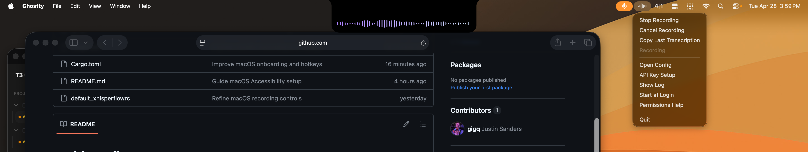

# xhisperflow

xhisperflow is a lightweight dictation app that records your voice, transcribes
it with `whisper-large-v3-turbo` on Groq, optionally cleans up the text with
`openai/gpt-oss-20b`, and inserts the final transcript into the app you were
using.

On macOS, xhisperflow runs as a menu bar app with a global hotkey, a small
waveform HUD while recording, onboarding for required permissions, and direct
paste into the active app. On Linux, it provides command-line tools that can be
bound to your window manager or desktop shortcuts for push-to-toggle dictation.



## Features

- Fast voice transcription using `whisper-large-v3-turbo`, with
  `whisper-large-v3` used for long recordings.
- Optional post-processing cleanup with `openai/gpt-oss-20b` for punctuation,
  capitalization, and wording.
- Global recording hotkeys
- Menu bar controls for recording, canceling, permissions, API key setup, and
  copying the last transcript.
- Floating waveform HUD while recording.
- Linux command-line workflow with notification updates through `notify-send`.
- Wayland-first typing via `wtype`, with clipboard output mode available.
- `xhisperflowtool` and `xhisperflowtoold` helpers for uinput paste, typing,
  and wrap-key workflows.

## Build

```sh
cargo build --bins
```

This produces:

- `target/debug/xhisperflow`
- `target/debug/xhisperflowtool`
- `target/debug/xhisperflowtoold`

## Release builds

GitHub release builds run when a `v*` tag is pushed:

```sh
git tag v0.1.0
git push origin v0.1.0
```

The release workflow publishes a Linux tarball and a universal macOS DMG.

## Runtime dependencies

- `pw-record`
- `notify-send` for notifications
- `arecord` for the live level meter
- `wtype` for direct Wayland typing
- `wl-copy` / `wl-paste` or `xclip` for clipboard support
- access to `/dev/uinput` when the helper daemon is used

## macOS

The macOS app is a native Rust menu bar app with a global recording hotkey,
floating waveform HUD, Groq-hosted transcription, and paste into the active app.

Build the app bundle:

```sh
scripts/build-macos-app.sh
open target/xhisperflow.app
```

The app uses `Option+Space` by default. Configure it in:

```sh
~/Library/Application Support/xhisperflow/xhisperflowrc
```

macOS hotkeys can be standard key chords like `option+space` or modifier-only
chords like `ctrl+opt`.

Use `cancel-hotkey` to bind a shortcut that discards the current recording
without transcription. Set it to an empty string to disable the cancel shortcut.

The floating HUD can be disabled with `mac-floating-waveform : false`. Its
waveform colors are configured with `mac-waveform-gradient-start` and
`mac-waveform-gradient-end` using quoted `#RRGGBB` values.

Use the menu bar app's Start at Login item to install a per-user LaunchAgent
for the current app.

Required macOS permissions:

- Microphone, for recording.
- Accessibility, for pasting the final transcript with Command+V.

On launch, the app checks Accessibility access. If it is missing, xhisperflow
shows a setup prompt. Clicking Allow opens the Accessibility page in System
Settings and keeps a helper window visible with the app path to drag into the
permission list.

The menu bar app includes a Permissions Help item that opens the relevant
System Settings panes. If Accessibility paste is not allowed, the transcript is
left on the clipboard.

## Config

Copy [default_xhisperflowrc](./default_xhisperflowrc) to:

```sh
~/.config/xhisperflow/xhisperflowrc
```

`GROQ_API_KEY` is read from the environment or `~/.env`.
